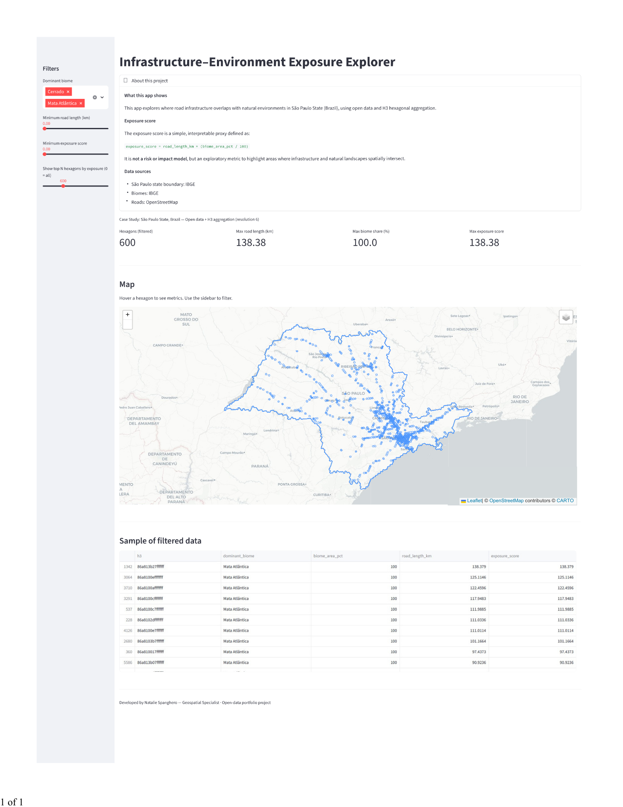

## Interactive Application


**Live demo:** https://infrastructure-environment-exposure.streamlit.app/

## Overview
A geospatial web application that explores where road infrastructure overlaps with natural environments in São Paulo State (Brazil) using open data and H3 hexagonal aggregation (resolution 6).

## Data sources
Raw datasets are not stored in this repository due to size constraints.
- São Paulo state boundary: IBGE (official administrative boundaries)
- Biomes: IBGE Biomes vector
- Roads: OpenStreetMap extract for São Paulo (.osm.pbf)

## Methodology
1. Load São Paulo boundary and biomes (WGS84).
2. Extract major roads from OSM (motorway, trunk, primary) and clip to the state boundary.
3. Generate an H3 grid (res=6) covering the state boundary.
4. Compute, for each hexagon:
   - Road length (km) within the hexagon
   - Dominant biome and its area share (%)
   - Exposure score = road_length_km × (biome_area_pct / 100)

## Run locally
```bash
python -m venv .venv
# activate venv
pip install -r requirements.txt

python src/load_data.py
python src/h3_grid.py
python src/spatial_metrics.py

streamlit run app/streamlit_app.py
